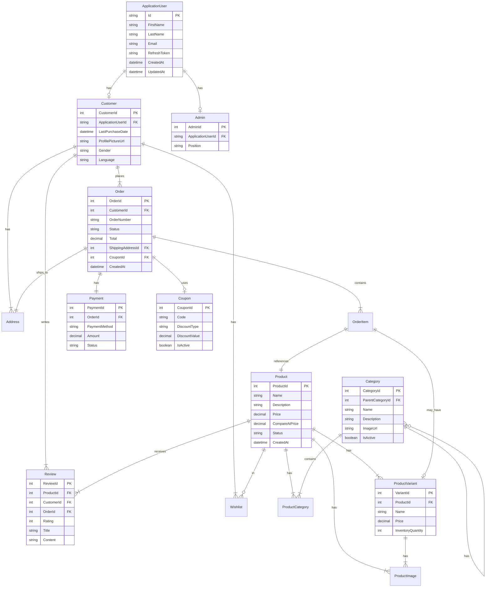

# 🛍️ Modern E-Commerce API

## 📋 Overview
A modern, scalable e-commerce API built with .NET Core 8, implementing industry best practices and cloud-ready architecture.


### Database Schema



## ⚙️ Technology Stack & Features

### Core Technologies
- [x] .NET Core 8 / C# 12
- [x] Entity Framework Core
- [x] CQRS with MediatR Pattern
- [x] Unit of Work & Generic Repository Pattern
- [x] JWT Authentication
- [x] ASP.NET Core Identity
- [x] Role-based Authorization
- [x] Fluent API
- [x] Fluent Validation
- [x] AutoMapper
- [x] Docker Containerization

### Cloud & Infrastructure (AWS)
- [x] AWS RDS (Production Database)
- [x] AWS S3 & CloudFront CDN (Image Storage)
- [x] AWS Secrets Manager (Production Secrets)
- [x] AWS ECR (Docker Repository)
- [x] AWS ECS (Container Orchestration)
- [x] AWS CloudWatch (Production Logging)

### Development Features
- [x] Email Service Integration
- [x] Swagger Documentation
- [x] Pagination Implementation
- [x] Filter Implementation
- [x] Specification Pattern
- [x] Unified API Response Structure
- [x] Global Error Handling
- [x] Image Processing (SixLabors.ImageSharp)
- [x] Development/Production Environment Configurations
- [x] User Secrets (Development)
- [x] Seq Logging (Development)
- [x] SQL Server (Development Database)

### Upcoming Features
- [ ] Rate Limiting
- [ ] Localization (Arabic + English)
- [ ] Google Authentication
- [ ] Stripe Payment Integration
- [ ] Notification System
- [ ] Redis Caching
- [ ] CI/CD Pipeline
- [ ] Unit Testing

## 🏗️ Project Structure

```
ECommerceApi/
├── ECommerceApi.Api/                 # API Layer - Main application entry point
│   ├── Controllers/                  # API endpoints controllers
│   ├── Configuration/                # API-specific configurations
│   ├── View/                        # View models and DTOs specific to API
│   ├── ResponseExample/             # Example responses for documentation
│   ├── Properties/                  # Project properties
│   ├── appsettings.json            # Main configuration file
│   ├── appsettings.Development.json # Development environment settings
│   ├── appsettings.Production.json  # Production environment settings
│   ├── Program.cs                   # Application startup configuration
│   └── ECommerceApi.Api.csproj      # API project file
│
├── ECommerceApi.Core/               # Core Layer - Business logic and domain
│   ├── Base/                        # Base classes and shared components
│   │   ├── Middleware/              # Custom middleware components
│   │   │   ├── ErrorHandlerMiddleware.cs  # Global error handling
│   │   │   └── ValidationBehavior.cs      # Request validation behavior
│   │   └── Response/
│   │       └── Response.cs          # Unified response structure
│   │
│   └── MediatrHandlers/             # CQRS handlers using MediatR
│       ├── Address/                 # Address feature module
│       │   ├── AddressDto.cs        # Address data transfer objects
│       │   ├── AddressMappingProfile.cs   # AutoMapper profile for Address
│       │   ├── Commands/            # Command handlers for Address
│       │   │   ├── CreateAddressHandler.cs
│       │   │   ├── DeleteAddressHandler.cs
│       │   │   └── UpdateAddressHandler.cs
│       │   └── Queries/             # Query handlers for Address
│       │       ├── GetAddressByIdHandler.cs
│       │       └── GetAddressesByCustomerIdHandler.cs
│
├── ECommerceApi.Data/               # Data Layer - Domain entities and data models
│   ├── Entities/                    # Domain entities
│   │   ├── Address.cs
│   │   ├── Admin.cs
│   │   ├── ApplicationUser.cs
│   │   ├── Category.cs
│   │   ├── Coupon.cs
│   │   ├── Customer.cs
│   │   ├── Order.cs
│   │   ├── OrderItem.cs
│   │   ├── Payment.cs
│   │   ├── Product.cs
│   │   ├── ProductCategory.cs
│   │   ├── ProductImage.cs
│   │   ├── ProductVariant.cs
│   │   ├── Review.cs
│   │   └── Wishlist.cs
│   └── Options/                     # Configuration options classes
│       ├── AppOptions.cs
│       ├── ImageProcessingOptions.cs
│       └── SecretOptions.cs
│
├── ECommerceApi.Infrastructure/      # Infrastructure Layer
│   ├── Base/                        # Base infrastructure components
│   │   ├── Specifications/          # Specification pattern implementation
│   │   │   ├── BaseSpecification.cs
│   │   │   ├── ISpecification.cs
│   │   │   └── SpecificationEvaluator.cs
│   │   ├── GenericRepository.cs     # Generic repository implementation
│   │   ├── IGenericRepository.cs    # Generic repository interface
│   │   ├── IUnitOfWork.cs          # Unit of work interface
│   │   └── UnitOfWork.cs           # Unit of work implementation
│   ├── Context/                     # Database context
│   │   └── ApplicationDbContext.cs
│   ├── Configurations/              # Entity configurations
│   ├── Migrations/                  # Database migrations
│   └── ModuleInfrastructureDependencies.cs  # Infrastructure DI setup
│
├── ECommerceApi.Service/            # Service Layer
│   ├── Base/                        # Base service components
│   │   ├── AuthResult.cs           # Authentication result model
│   │   └── PaginationList.cs       # Pagination implementation
│   ├── IService/                    # Service interfaces
│   ├── Service/                     # Service implementations
│   ├── Specification/               # Business specifications
│   └── ModuleServiceDependencies.cs # Service DI setup
│
├── Dockerfile                       # Docker configuration
└── docker-compose.yml               # Docker compose configuration
```

## 🚀 Getting Started

### Prerequisites
- [.NET Core SDK 8.0](https://dotnet.microsoft.com/download/dotnet/8.0)
- [SQL Server](https://www.microsoft.com/en-us/sql-server/sql-server-downloads)
- [Docker](https://www.docker.com/products/docker-desktop) (optional)
- [AWS Account](https://aws.amazon.com/) (for production deployment)
- [Gmail Account](https://gmail.com) (for email service)

### Configure User Secrets

The project uses user secrets for managing sensitive configuration. To set up your development environment:

1. **Initialize user secrets**
```bash
cd ECommerceApi.Api
dotnet user-secrets init
```

2. **Add the following secrets configuration**
```json
{
  "Secrets": {
    "ConnectionStrings": {
      "DefaultConnection": "Data Source=YOUR_SERVER;Database=ECommerceApiDB;Integrated Security=True;Trust Server Certificate=True"
    },
    "EmailSettings": {
      "Host": "smtp.gmail.com",
      "Port": 587,
      "UserName": "your.email@gmail.com",
      "Password": "your-app-specific-password"
    },
    "JWT": {
      "Key": "your-secret-key-min-16-characters",
      "Issuer": "SecureApi",
      "Audience": "SecureApiUser",
      "AccessTokenExpirationMinutes": 30
    },
    "AWS": {
      "AccessKey": "your-aws-access-key",
      "SecretKey": "your-aws-secret-key",
      "BucketName": "your-bucket-name",
      "Region": "your-aws-region",
      "CloudFrontDomain": "your-cloudfront-domain"
    }
  }
}
```

3. **Important Security Notes**
- Never commit actual secrets to source control
- Use app-specific passwords for Gmail
- Rotate AWS access keys regularly
- Use strong JWT keys (minimum 16 characters)
- In production, use AWS Secrets Manager or similar service

4. **Email Service Setup**
- Enable 2-Step Verification in your Gmail account
- Generate an App Password:
    1. Go to Google Account Settings
    2. Security
    3. 2-Step Verification
    4. App Passwords
    5. Generate new app password for 'Mail'

5. **AWS Setup**
- Create an AWS IAM user with appropriate permissions
- Create an S3 bucket with the specified name
- Set up CloudFront distribution for the S3 bucket
- Configure CORS policy for the S3 bucket

### Local Development Setup

1. **Clone the repository**
```bash
git clone https://github.com/yourusername/ECommerceApi.git
cd ECommerceApi
```

2. **Configure Development Settings**

   Create `appsettings.Development.json`,`appsettings.Production.json` in the ECommerceApi.Api directory:
   ```json
   {
     "Serilog": {
       "MinimumLevel": {
         "Default": "Debug",
         "Override": {
           "Microsoft": "Information",
           "Microsoft.Hosting.Lifetime": "Information",
           "Microsoft.EntityFrameworkCore": "Information"
         }
       },
       "WriteTo": [
         {
           "Name": "Seq",
           "Args": {
             "serverUrl": "http://localhost:5341"
           }
         }
       ],
       "Enrich": [
         "FromLogContext",
         "WithMachineName",
         "WithThreadId",
         "WithExceptionDetails"
       ]
     },
     "Secrets": {
       "AppUrl": "http://localhost:5218",
       "ConnectionStrings": {
         "DefaultConnection": "Data Source=YOUR_SERVER;Database=ECommerceApiDB;Integrated Security=True;Trust Server Certificate=True"
       },
       "EmailSettings": {
         "Host": "smtp.gmail.com",
         "Port": 587,
         "UserName": "your.email@gmail.com",
         "Password": "your-app-specific-password"
       },
       "JWT": {
         "Key": "your-secret-key-min-32-characters",
         "Issuer": "SecureApi",
         "Audience": "SecureApiUser",
         "AccessTokenExpirationMinutes": 30
       },
       "AWS": {
         "AccessKey": "your-aws-access-key",
         "SecretKey": "your-aws-secret-key",
         "BucketName": "your-bucket-name",
         "Region": "your-aws-region",
         "CloudFrontDomain": "your-cloudfront-domain"
       }
     }
   }
   ```

3**Set up the database**
```bash
cd ECommerceApi.Api
dotnet ef database update
```

4. **Run the application**
```bash
dotnet run
```

The API will be available at `https://localhost:5001`

### Docker Setup

1. **Build the Docker image**
```bash
docker build -t ecommerce-api .
```

2. **Run with Docker Compose**
```bash
docker-compose up -d
```

## 📚 API Documentation

### Authentication

The API uses JWT Bearer token authentication. To access protected endpoints:

1. Register a new user at `POST /api/auth/register`
2. Login at `POST /api/auth/login` to receive a JWT token
3. Include the token in the Authorization header: `Bearer {token}`

### Available Endpoints

Detailed API documentation is available through Swagger UI at `/swagger` when running the application.

#### Core Endpoints:

- 🛍️ Products
- 👤 Users/Customers
- 📦 Orders
- 🏷️ Categories
- 💳 Payments
- 📝 Reviews

## 🔒 Security

- JWT token-based authentication
- Role-based access control
- Password hashing with ASP.NET Core Identity
- HTTPS enforcement
- Cross-Origin Resource Sharing (CORS) configuration
- Input validation using Fluent Validation
- Protection against common web vulnerabilities

## 🚀 Deployment

### AWS Deployment

1. **Configure AWS Credentials**
    - Set up AWS CLI
    - Configure credentials for ECR, ECS, and other services

2. **Database Migration**
   ```bash
   dotnet ef database update --connection "production-connection-string"
   ```

3. **Push Docker Image**
   ```bash
   aws ecr get-login-password --region region | docker login --username AWS --password-stdin aws_account_id.dkr.ecr.region.amazonaws.com
   docker build -t ecommerce-api .
   docker tag ecommerce-api:latest aws_account_id.dkr.ecr.region.amazonaws.com/ecommerce-api:latest
   docker push aws_account_id.dkr.ecr.region.amazonaws.com/ecommerce-api:latest
   ```

4. **Deploy to ECS**
    - Update task definition
    - Update ECS service

## 🛠️ Development Guidelines

### Coding Standards
- Follow C# coding conventions
- Use meaningful names for variables, methods, and classes
- Write XML documentation for public APIs
- Keep methods small and focused
- Use SOLID principles

### Git Workflow
1. Create feature branch from `development`
2. Make changes and commit with meaningful messages
3. Open pull request to `development`
4. Code review and approval
5. Merge to `development`
6. Regular releases to `main`

## 📊 Monitoring & Logging

### Development
- Seq logging dashboard available at `http://localhost:5341`
- Detailed exception logging
- Request/Response logging

### Production
- AWS CloudWatch logs
- Performance metrics
- Error tracking
- Resource utilization monitoring

## 🤝 Contributing

1. Fork the repository
2. Create your feature branch (`git checkout -b feature/AmazingFeature`)
3. Commit your changes (`git commit -m 'Add some AmazingFeature'`)
4. Push to the branch (`git push origin feature/AmazingFeature`)
5. Open a Pull Request

## 📄 License

This project is licensed under the MIT License - see the [LICENSE](LICENSE) file for details.

## 📞 Support

For support, email abdalla.hassanin.2000@gmail.com or create an issue in the GitHub repository.

## ✨ Acknowledgements

- [ASP.NET Core Documentation](https://docs.microsoft.com/en-us/aspnet/core)
- [Entity Framework Core](https://docs.microsoft.com/en-us/ef/core)
- [AWS Documentation](https://docs.aws.amazon.com)
- All contributors who have helped this project grow

---
Made with ❤️ by [Abdalla Hassanin]


